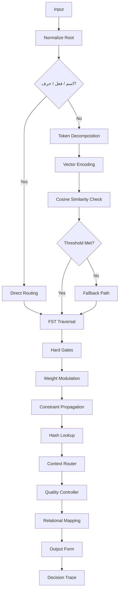

# 📘 SARFM: Symbolic Arabic Root Fingerprint Morphology

> **A deterministic, rule-based morphological engine for Classical Arabic.**  
> Zero statistics. Zero neural networks. 100% traceable. Bidirectional encode/decode symmetry.

[](https://www.python.org/downloads/)
[](https://opensource.org/licenses/MIT)
[](#)

---

## ⚖️ Design Philosophy: Structure Over Statistics

Modern NLP pipelines often rely on dense vector embeddings paired with cosine similarity, scaled through transformer architectures that improve predictably with more data. While effective for broad language modeling, this paradigm struggles with **Arabic morphological sciences** (علم الصرف، الاشتقاق، الأوزان، الإعلال). Statistical models treat morphological patterns as emergent properties of token co-occurrence, sacrificing rule enforcement, grammatical guarantee, and decision traceability.

SARFM inverts this paradigm. Instead of learning implicit relations from massive corpora, it **encodes explicit morphological structure** as computational constraints. The system prioritizes:
- **Rule density over parameter count:** Morphological validity is enforced through deterministic state transitions, not soft attention weights.
- **Path exploration over gradient descent:** Multiple structurally valid derivations are evaluated via gated traversal, not collapsed into a single probabilistic distribution.
- **Lexical provenance over latent space:** Every decision maps back to classical dictionary entries, pattern catalogs, and documented linguistic rules.
- **Word-centric lightweight computation:** Analysis operates at the lexical unit level, avoiding heavy context windows, global relation matrices, or quadratic attention complexity.

This architecture ensures that morphological analysis and generation remain **fully auditable, grammatically sound, and computationally lean**, regardless of dataset scale.

---

## 🧭 Architectural Path & Processing Flow
Here is the complete architectural flow of SARFM rendered in Mermaid. It maps the deterministic pipeline, decision gates, FST validation, and dataset-driven relational mapping exactly as specified in the architecture path.




### 🔹 Stage 1: Lexical Categorization Gateway
The pipeline begins with a hard structural classifier that attempts to resolve the word's primary lexical class:
- **اسم (Noun)**: Identified by definitive markers (`الـ`, tanwīn, jar/preposition governance, nominal case endings).
- **فعل (Verb)**: Identified by verbal markers (tāʾ al-fāʿil, yāʾ al-mukhāṭaba, nūn al-tawkīd, temporal prefixes).
- **حرف (Particle)**: Matched against a closed lexical registry.

If classification succeeds, the system routes directly to the corresponding morphological subgraph. If markers are ambiguous or absent, the word enters the token-level resolution pipeline.

### 🔹 Stage 2: Token-Level Similarity Gating
Ambiguous or unmarked forms are decomposed into sequential tokens: `[prefix] → [root radicals] → [internal vowels] → [suffix]`. Each token is encoded into a lightweight semantic vector and compared against the dataset registry via **step-wise cosine similarity**:
- Similarity scores act as **deterministic routing signals**, not probabilistic confidences.
- Thresholds are fixed and linguistically grounded (e.g., prefix alignment ≥ 0.75 routes to verbal conjugation paths).
- Mismatches trigger structural fallbacks rather than soft redistribution.

### 🔹 Stage 3: FST Structural Validation
Tokens traverse a **Finite-State Transducer** where each state represents a morphological position (fadl, ʿayn, lām, vocalization slot, affix attachment). Transitions are governed by:
- **Hard gates**: Invalid root-pattern combinations are pruned immediately.
- **Step-wise weight application**: Semantic fingerprints modulate transition priorities incrementally, preventing global weight interference.
- **Constraint propagation**: Vowel harmony, defectiveness (ʿilla), and gemination rules are enforced as state-level invariants.

### 🔹 Stage 4: Dataset-Driven Relational Mapping
Prefix-suffix relations and derivational pathways are resolved through **O(1) hash-table lookups** into the semantic index:
- The dataset provides pre-computed fingerprint vectors, pattern catalogs, and context tags.
- Cosine similarity between token vectors and registry entries determines relational alignment (e.g., suffix `ـونَ` → collective noun pathway).
- All mappings are versioned and traceable; no latent interpolation or vector averaging occurs.

### 🔄 Pipeline Summary
```
[Surface Form] 
   → Lexical Categorization (اسم/فعل/حرف)
   → [If Ambiguous] Token Decomposition & Step-wise Cosine Routing
   → FST State Traversal (Hard Gates + Incremental Weight Modulation)
   → Hash-Table Relational Lookup (Dataset-Driven Prefix/Suffix Mapping)
   → [Output] Morphologically Valid Form + Full Decision Trace
```

---

## 🏗️ Core Modules

| Module | Responsibility |
|--------|----------------|
| `RootNormalizer` | Deterministic canonicalization (strip tashkeel, unify alef/hamza, standardize weak finals) |
| `SemanticIndex` | O(1) hash-index mapping normalized roots → memory offsets & records |
| `TransitionMaskRegistry` | Static 40D sensitivity vectors pre-assigned to FST transitions |
| `ContextRouter` | Hard-wires `pattern_matches` & `context_tags` to FST activation/deactivation rules |
| `QualityController` | Applies fixed penalties for `PARTIAL` records; resolves `MULTI_SENSE` via precedence rules |
| `FST_Engine` | Weighted traversal with structural validation & tie-breaking |

---

## 🚀 Installation

```bash
# Clone repository
git clone https://github.com/yourorg/sarfm.git
cd sarfm

# Create virtual environment
python -m venv venv
source venv/bin/activate  # On Windows: venv\Scripts\activate

# Install dependencies
pip install numpy  # Optional but recommended for vector operations
```

Place your compiled lexicon dataset at `data/sarfm_lexicon.json` (schema documented below).

---

## 💻 Quick Start

### 🔹 Encode Preparation (Python API)
```python
from sarfm.encoder import encode_prepare

# Prepare deterministic encode directives for root "تبل" in agricultural context
directives = encode_prepare(
    root="تبل",
    json_dataset_path="data/sarfm_lexicon.json",
    target_context="ENTITY_PLANT"
)

print(directives["status"])              # → "READY"
print(directives["active_fingerprint"])  # → 40-dim vector aligned with plant semantics
print(directives["routing_directive"])   # → activated transitions, constraints, offsets
print(directives["quality"]["trace_msg"])# → "MULTI_SENSE_FILTERED_BY_ENTITY_PLANT"
```

### 🔹 Command Line Interface
```bash
# Encode a root with explicit semantic context
python sarfm_cli.py encode --root "تاج" --context "ENTITY_OBJECT" --output directives.json

# Decode a surface word to semantic fingerprint
python sarfm_cli.py decode --word "التِّيجَانُ" --output fingerprint.json
```

---

## 📊 Dataset Specification

SARFM expects a JSON array of root records matching this schema:

```json
{
  "root": "تبل",
  "fingerprint_vector": [0.0, 0.33, 0.67, ..., 0.5],
  "validation_flags": ["MULTI_SENSE"],
  "sense_records": [
    {
      "sense_id": "ROOT_TBL_SENSE_PLANT",
      "primary_category": "ENTITY_PLANT",
      "vector_slice": [0.0, 1.0, 0.0, ..., 0.5],
      "confidence": "FULL",
      "provenance": "matched 'النّخْل'"
    }
  ],
  "pattern_matches": [{"pattern": "تَفَعَّلَ", "function": "CAUSATIVE_INTENSIVE"}],
  "context_tags": [{"context": "CONTEXT_AGRICULTURAL", "source_phrase": "نَخْلٌ مُتَبَتِّل"}]
}
```

### 🔑 Key Fields
| Field | Purpose |
|-------|---------|
| `fingerprint_vector` | 40-dimensional normalized semantic vector |
| `validation_flags` | `FULL`, `PARTIAL`, or `MULTI_SENSE` |
| `sense_records` | Disambiguated semantic branches with `vector_slice` |
| `pattern_matches` | Explicit morphological patterns triggering FST subgraphs |
| `context_tags` | Pragmatic/domain tags applying priority offsets |

---

## 🔐 Determinism & Auditing

SARFM guarantees mathematical transparency through:

1. **Immutable Vectors:** Fingerprints never change at runtime. Updates require versioned dataset releases.
2. **Fixed Arithmetic:** All weight modulation uses `base + (vector • mask)`. No dynamic learning, no thresholds beyond documented gates.
3. **Provenance Logging:** Every output includes:
   ```json
   "trace": {
     "selected_sense": "ROOT_TBL_SENSE_PLANT",
     "activated_dimensions": [1, 35, 39],
     "routing_reason": "MULTI_SENSE_FILTERED_BY_ENTITY_PLANT",
     "mask_modifiers": {"ROOT_SLOT_2": 0.82, "SUFFIX_NOUN_PL": 0.65}
   }
   ```
4. **Version Control:** Dataset, mask registry, and routing tables are version-tagged. Reproduction requires identical version hashes.

---

## 🗺️ Roadmap

| Phase | Milestone | Status |
|-------|-----------|--------|
| **v0.1** | Semantic Index, Mask Registry, Context Router, Quality Controller | ✅ Complete |
| **v0.2** | FST Traversal Engine (encode direction) |  In Development |
| **v0.3** | Decoder Module (surface → fingerprint reconstruction) | 📋 Planned |
| **v0.4** | Mask Population Toolkit (linguist UI for weight authoring) | 📋 Planned |
| **v1.0** | Full bidirectional pipeline, performance benchmarks, academic paper | 📋 Planned |

---

## 🤝 Contributing

SARFM is designed for linguistic researchers, computational morphologists, and NLP engineers who value transparency over black-box performance.

**How to contribute:**
- Add root records following the `protocol_v1.0` extraction guidelines
- Author transition sensitivity masks with classical references
- Submit routing rule extensions with documented precedence logic
- Improve normalization edge cases (dialectal variants, orthographic shifts)

All contributions must include deterministic test cases and provenance documentation.

---

## 📜 License

Distributed under the **MIT License**. See `LICENSE` for details.

---

## 📚 Citation

If you use SARFM in academic research, please cite:
```bibtex
@misc{sarfm2026,
  author = {SARFM Contributors},
  title = {SARFM: Symbolic Arabic Root Fingerprint Morphology},
  year = {2026},
  howpublished = {\url{https://github.com/yourorg/sarfm}},
  note = {Deterministic morphological encoding/decoding for Classical Arabic}
}
```

---

> **SARFM does not guess. It computes.**  
> Built on centuries of Arabic linguistic scholarship. Engineered for mathematical transparency. Ready for the next generation of transparent NLP.
